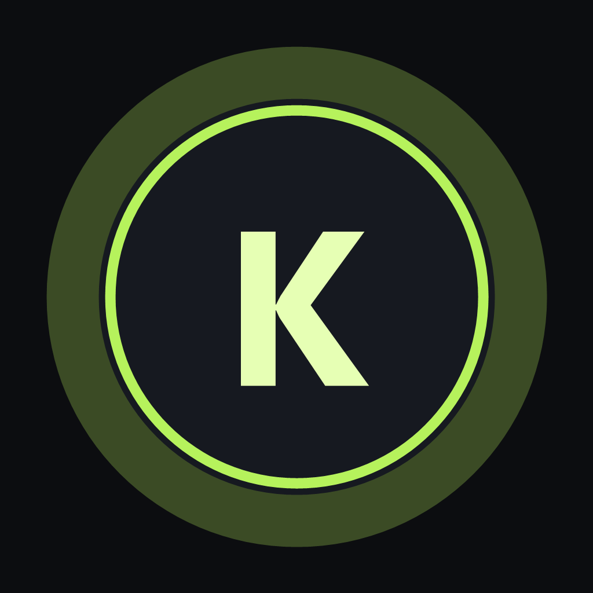

<div align="center">

[English](README.md) | [한국어](README.ko.md) | [日本語](README.ja.md)

  

# KeyGlow

### 키보드를 보고, 모든 키를 제어하세요.

Windows용 경량·로컬 우선 비주얼 키보드 컨트롤러입니다.

화면 속 키보드에서 원하는 키를 클릭해 비활성화하고, 다시 클릭하면 즉시 활성화할 수 있습니다. KeyGlow는 단순히 UI 상태만 바꾸는 것이 아니라 Windows 입력 레벨에서 실제 키 입력을 제어합니다.

[](#지원-플랫폼)
[](https://tauri.app/)
[](https://www.rust-lang.org/)
[](https://react.dev/)
[](#프라이버시)

</div>

---

## 왜 KeyGlow인가요?

대부분의 키보드 설정 프로그램은 특정 제조사 하드웨어에 종속되어 있습니다. KeyGlow는 Logitech, Razer, Keychron, Leopold, Akko 등 특정 브랜드와 무관하게 동작하는 범용 비주얼 컨트롤러를 지향합니다.

사용 중인 실제 키보드와 가장 가까운 키보드 종류를 고른 뒤, 화면에서 원하는 키를 직접 제어하면 됩니다.

- 키 클릭 → 비활성화
- 다시 클릭 → 활성화
- 실제 키 입력 → 화면에서 실시간 점등
- 재시작 없이 키보드 종류 전환
- 작업용 / 게임용 / 사용자 정의 프로필 저장
- 계정, 텔레메트리, 클라우드 없이 로컬에서 동작

> KeyGlow는 키보드 모양만 보여주는 목업이 아닙니다. 비활성화된 키는 Windows 저수준 키보드 훅에서 실제로 차단됩니다.

## 인터페이스

KeyGlow의 핵심 상태 표현은 단순합니다.

| 상태 | 의미 |
| --- | --- |
| 🟢 형광 점등 | 활성화된 키 |
| ✨ 강한 점등 / 눌림 | 현재 실제로 누르고 있는 키 |
| ⚫ 어두움 | 비활성화된 키 |

### 스크린샷

릴리스 빌드에서 실제 Windows 앱 화면을 캡처한 뒤 여기에 넣을 예정입니다.

권장 캡처:

- 약 `1440 × 900` 창 크기
- `데스크톱 키보드 (숫자패드 있음)` 선택
- 2~3개 키 비활성화 상태
- 가능하면 한 키가 눌려 형광으로 점등된 상태
- Windows 배율 100% 또는 125%
- `docs/assets/keyglow-main.png`로 저장

추후 아래와 같이 교체합니다.

```html
<p align="center">
  
</p>
```

## 주요 기능

### 키별 비주얼 제어

화면 속 키보드에서 지원되는 키를 클릭하면 해당 입력을 Windows로 전달할지 즉시 전환할 수 있습니다.

### 실시간 키 점등

실제 키보드의 key-down / key-up 이벤트가 UI에 반영되어 가상 키보드가 실시간 컨트롤 서피스처럼 동작합니다.

### 다양한 키보드 종류

KeyGlow는 물리적인 키보드 종류와 동작 프로필을 별개로 관리합니다.

| 키보드 종류 | 설명 |
| --- | --- |
| 데스크톱 키보드 | 숫자패드가 있는 일반 PC 키보드 |
| 슬림 데스크톱 | 숫자패드만 없는 일반 데스크톱 키보드 |
| 컴팩트 키보드 | 방향키와 F키가 있는 작은 배열 |
| 미니 키보드 | 방향키는 있고 별도 F키 줄은 없는 작은 배열 |
| 노트북형 키보드 | 방향키와 F키 줄이 없는 가장 작은 배열 |

사용자 화면에서는 TKL, 75%, 65%, 60% 같은 매니아 중심의 비율 표기보다 실제 형태를 바로 이해할 수 있는 키보드 종류 이름을 사용합니다.

내부적으로는 `fullsize-ansi`, `tkl-ansi`, `75-ansi`, `65-ansi`, `60-ansi` 같은 데이터 기반 레이아웃 정의를 그대로 사용하므로, 렌더러를 다시 만들지 않고 새로운 키보드 종류를 추가할 수 있습니다.

### 프로필

상황별로 다른 키 상태를 저장할 수 있습니다.

- Default
- Gaming
- Coding
- 사용자 정의 프로필

프로필 생성, 복제, 이름 변경, 초기화, 삭제 및 재시작 후 복원이 가능합니다.

### 🐈 Cat Lock

고양이, 아이, 청소용 천 등이 키보드 위에 올라왔을 때 모든 키를 즉시 차단하는 기능입니다.

Cat 버튼 또는 다음 긴급 단축키로 해제할 수 있습니다.

```text
Ctrl + Shift + F12
```

### 긴급 해제

`Ctrl + Shift + F12`는 일반 프로필에서 비활성화할 수 없습니다. 실행 즉시 모든 키를 다시 활성화하고 Default 프로필로 돌아갑니다.

### 시스템 트레이

메인 창을 닫으면 KeyGlow는 트레이로 숨겨집니다. 트레이 메뉴에서 완전히 종료하면 키보드 훅이 해제되고 정상 입력 상태로 복원됩니다.

### 다국어 UI

현재 지원 언어:

- English
- 한국어
- 日本語

## 동작 방식

```text
물리 키보드
     ↓
WH_KEYBOARD_LL  (SetWindowsHookExW)
     ↓
KeyGlow FilterEngine
     ↓
 비활성화 상태인가?
    /       \
   예       아니오
   ↓          ↓
이벤트 차단   CallNextHookEx
               ↓
          Windows 앱
```

키보드 훅 콜백은 의도적으로 최소한의 작업만 수행합니다.

- 디스크 I/O 없음
- 네트워크 요청 없음
- 입력 키 로그 저장 없음
- 훅 내부에서 React 작업 없음
- 저비용 인메모리 상태 조회 및 이벤트 전달만 수행

UI 업데이트는 비동기로 전달해 키보드 필터링 지연을 최소화합니다.

## 지원 플랫폼

| 플랫폼 | 상태 |
| --- | --- |
| Windows 11 | ✅ 지원 |
| Windows 10 | ✅ 지원 |
| macOS | ⏳ 미지원 |
| Linux | ⏳ 미지원 |

Windows 전용 입력 코드는 네이티브 플랫폼 레이어에 분리되어 있어 향후 다른 OS 지원을 확장할 수 있습니다.

## 빠른 시작

### 요구 사항

- Node.js 20+
- Rust stable 1.77+
- WebView2
- MSVC C++ toolchain이 포함된 Visual Studio Build Tools

### 개발 실행

```bash
git clone https://github.com/sapgun/KeyGlow.git
cd KeyGlow
npm install
npm run tauri dev
```

레이아웃 생성기 수정 후 JSON 재생성:

```bash
npm run gen:layouts
```

전체 테스트:

```bash
npm run test:all
```

## Windows 빌드

```bash
npm run tauri build
```

예상 출력:

```text
src-tauri/target/release/bundle/nsis/KeyGlow_0.1.0_x64-setup.exe
release/KeyGlow_0.1.0_x64-setup.exe

src-tauri/target/release/keyglow.exe
release/KeyGlow.exe
```

현재 설치 프로그램은 사용자 단위 설치를 사용하며 일반적인 사용에는 관리자 권한이 필요하지 않습니다.

## 프라이버시

KeyGlow는 로컬 우선으로 설계되었습니다.

- 텔레메트리 없음
- 분석 기능 없음
- 클라우드 계정 없음
- 네트워크 연결 불필요
- 입력한 키 기록을 디스크에 저장하지 않음
- 레지스트리를 이용한 영구 키 차단 없음

실시간 key-down/up 이벤트는 로컬 UI에서 키캡을 점등하기 위한 용도로만 사용됩니다.

설정은 일반적으로 다음 위치에 저장됩니다.

```text
%APPDATA%\com.keyglow.app\settings.json
```

## 안전 및 제한사항

KeyGlow는 일반 사용자 모드에서만 동작하도록 설계했습니다.

- 현재 필터링은 개별 물리 키보드가 아니라 Windows 세션 전체에 적용됩니다.
- `Ctrl + Alt + Delete`와 Secure Attention Sequence는 Windows가 보호합니다.
- 대부분의 키보드에서 `Fn` 키는 펌웨어가 처리하므로 일반 Windows 키처럼 가로챌 수 없습니다.
- KeyGlow가 종료되거나 비정상 종료되면 훅도 사라지므로 키보드는 정상 입력 상태로 돌아갑니다.

자세한 내용: [docs/LIMITATIONS.md](docs/LIMITATIONS.md)

## 프로젝트 문서

- [Architecture](docs/ARCHITECTURE.md)
- [Known limitations](docs/LIMITATIONS.md)
- [Manual test checklist](docs/TEST-CHECKLIST.md)

## 로드맵

Windows v0.1 기반이 안정화된 이후 고려할 기능:

- 앱별 프로필
- Raw Input 기반 물리 키보드 구분
- ISO / JIS 레이아웃
- HHKB / Alice / Split 배열
- 사용자 정의 레이아웃 가져오기
- 키 리매핑
- 매크로 및 레이어
- 선택적 QMK / VIA 연동

## 기여

Issue, 버그 리포트, 키보드 종류/레이아웃 기여, UX 피드백, Pull Request를 환영합니다.

키보드 훅 관련 버그를 제보할 때는 다음 정보를 포함해 주세요.

- Windows 버전
- 키보드 종류 / 프로필
- 문제가 발생한 키
- 긴급 해제 후에도 재현되는지 여부

## ❤️ KeyGlow 후원

KeyGlow가 유용했다면 Star, 재현 가능한 버그 제보, 키보드 레이아웃 기여, 프로젝트 공유 또는 후원으로 개발을 지원할 수 있습니다.

[](https://ko-fi.com/sapgun)

### Crypto

| 네트워크 / 방식 | 후원 주소 |
| --- | --- |
| Ethereum | `0xDF2930264Cf2285eB76C232b3a1233f0c5D4b471` |
| Solana | `BzsE914REG8op1uonEv7rz2NxiS9k3Jcrivz84NdNd5H` |
| Tether ID | `sapgun98@tether.me` |

> 전송 전 주소와 네트워크를 반드시 다시 확인하세요. 암호화폐 전송은 되돌릴 수 없습니다. Ethereum 주소는 Ethereum 네트워크, Solana 주소는 Solana 네트워크를 사용하세요. Tether ID는 `tether.me` 식별자를 명시적으로 지원하는 서비스에서만 사용하세요.

PayPal은 공개 PayPal 결제 링크 또는 PayPal.Me 주소가 준비되면 추가할 예정입니다. PayPal 계정 대시보드 주소는 공개 후원 링크가 아닙니다.

---

<div align="center">

Tauri · Rust · React · TypeScript로 제작

**KeyGlow — 키보드를 보고, 모든 키를 제어하세요.**

</div>
